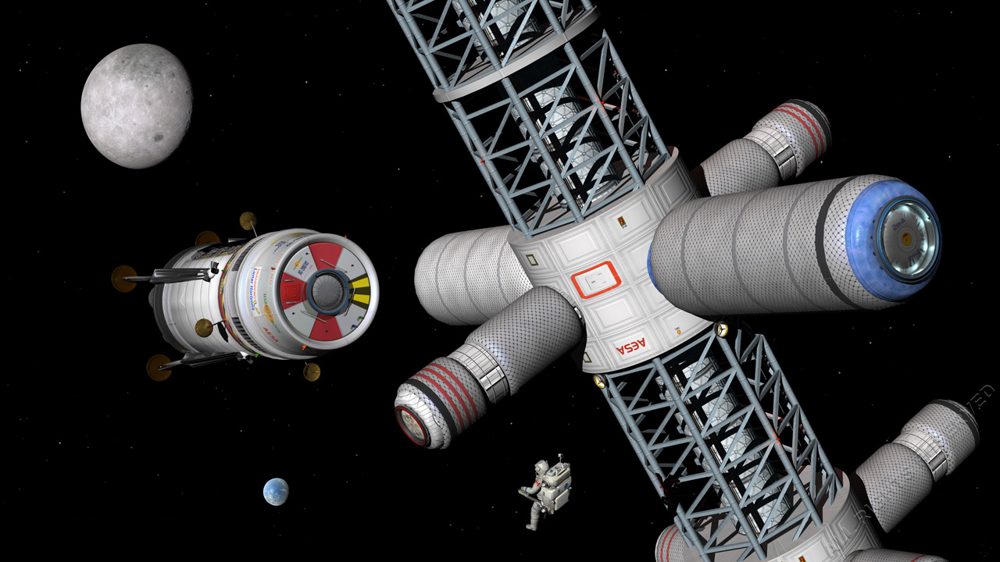

# New Inc.

First of all, thank you for taking the time to sit this coding test. We really appreciate it!

This repository has been created exclusively for you. Use it as your own and upload all the code/comments/etc. here. Please, do not share this test nor the solution with anyone. In case you have any doubt please write an Issue, and we will respond on the same channel.

## TODO

This repository contains an implementation problem and a possible solution. You are asked to **propose 5 things you will change and/or improve, those can be refactors or new features but as meaningful as possible (we try to size your knowledge. ie. rename the packaging doesn't tell us very much)** in the existing code (application code, architecture,new screens, [Bonus points requirements](#bonus-points-requirements), the building process, rollout...) **and implement one of them**.

### Documentation

- The [SOLUTION.md](SOLUTION.md) file contains information on the assumptions of the current solution. the Improvements section of that file.
- The [HOW-TO-RUN.md](HOW-TO-RUN.md) file provides information on how to test the current solution. Please document any change you make the way the code is run in this file.
- **Please document all you do and all your 5 proposals/suggestions/etc. in the [IMPROVEMENTS.md](IMPROVEMENTS.md) file.**

### Highly Important!!

- Justify all your design/coding decisions.
- Nothing is good or bad as long as is justified.
- We highly value incremental delivery

### Technical Stack

- **_Backend using Java & Spring boot_**. Junit for tests + other frameworks if needed (i.e. Mockito)
- **_Frontend using Angular 8+_**. Unit tests with karma+jazmine, e2e tests with protractor

## Introduction

Humankind has finally been able to colonize the Moon and has established a whole city called Artemis. **Artemis economy is based on tourism**, which means that there is an actual brand new industry dedicated to space travel. **_The way it works is the following:_**

A spaceship takes humans to LEO (Low Earth Orbit) and docks to a lunar cycler. The lunar cyclers are basically flying hotels, in an **_[infinite-like orbit](cycler-map.png)_** between the Earth and the Moon (no fuel required). They never stop, they are constantly cycling. It takes 7 days to get from LEO (Low Earth Orbit) to LLO (Low Lunar Orbit).

After dropping the passengers, the docked spaceship goes back to earth with returning passengers. When the lunar cycler arrives at the Moon’s orbit, a spaceship travels from the moon base to LLO, it drops the passengers returning to the Earth and comes back with passengers whose final destination is the moon.

To travel from Earth to LEO and Moon to LLO, we’re using spaceships that can carry up to a specific weight. There are spaceships to give service to the Earth-LEO route and other spaceships to give service to the Moon-LLO route.

Spaceships traveling Earth-LLO are docked to lunar cyclers during 24 hs. Hence, there are 3 types of packages available departing from the Earth:

- **_Charles Conrad space baptism_**. Flight to LEO + access to hotel facilities during 24 hs (no room) + Flight back to Earth.
- **_Buzz Aldrin oddity_**. Flight to LEO + 13 lunar cycler hotel nights + Flight back to Earth.
- **_Neil Armstrong space explorer_**. Flight to LEO + 13 lunar cycler hotel nights + 6 nights at moon hotel + Flight back to Earth.

## The numbers

**Flight cost** is an equation that depends on two factors: the type of propellant used, and the markup. Both values depend on the spaceship configuration. For instance if the fuel cost is 10 € and markup 3x, then the flight costs 30 €.

Space Tours buys the propellants from a company called **Propellant Markt Inc**, which holds an API for retrieving propellant prices with the following specification:

```js
GET /propellants => Lists all propellants. i.e.
[{id: 1, name: “LOX/RP-1”}, {id: 2, name: “LOX/LH2”}]

GET /propellants/:id => Propelant details.
{id: 1, name: “LOX/RP-1”, baseUnit: “kg”, carryCapacity: {amount: 0.5, unit: “kg”}}, price: 0.202}
```

The propellant data is read as: To elevate **_thrust.carryCapacity_** it needs 1 **_baseUnit_** of propellant. **Each spaceship uses different kinds of fuels**. Space tours will provide all the spaceships information.

For instance, based on the example above if the spaceship uses LOX/RP-1, in order to elevate 100kg it needs 200kg of propellant, and the fuel cost is 40,4€.

**Hotel rates are fixed**

## Requirements for MVP

Provide a simple website (and its backend) to:

1. List of all spaceships. Allow sorting and filtering by name.
2. Check availability for a date, including number of available tickets and prices for each kind of package.

## Bonus points requirements

3. Allow booking a package on a certain date for a number of passengers.
4. Show type and amount of fuel to buy for a certain flight (by date), according to the booked capacity.

> **Important Note**: Space Tours Inc. is thinking of opening a subsidiary on Mars (and possibly a third one on Ceres) to give service to the asteroid mining industry using the same spaceship + cyclers methodology, so have in mind that the application might scale quickly, and you need to create an architecture according to it (maybe multi tenancy, multiple deploys with different configurations, other options you might consider).

## A practical cost-calculation example

**We need to take 20000kg of cargo to LEO using a spaceship that weighs 160000 kg and uses LOX/RP-1 as propellant, with a markup of 5x**

So, to take 20000kg (plus spaceship weight) to LEO it would cost:

- **kgPropellant** =carriedWeight / carryCapacityPerKgOfFuel = 180000kg/0.5=360000kg
- **costPropellant** = kgPropellant\*pricePerKg = 360000kg\*0.202€/kg = €72720
- **costFlight** = costPropellant\*markup = €363600

Or what’s the same, **18,18€/kg**

### Spaceships servicing Earth-LEO route

| Spaceship  |   Booster    |   Weight   | Max capacity | Propellant |
| :--------: | :----------: | :--------: | :----------: | :--------: |
|   Dragon   |   Falcon 9   | 549045 kg  |   22800 kg   |  LOX/RP-1  |
| Big Dragon | Falcon Heavy | 1420788 kg |   63800 kg   |  LOX/RP-1  |
|  Feather   |   Falcon 9   | 1104534 kg |   45000 kg   |  NTO/RP-1  |

### Spaceships servicing Moon-LLO route

| Spaceship | Booster  |   Weight   | Max capacity | Propellant |
| :-------: | :------: | :--------: | :----------: | :--------: |
| New moon  | Atlas IV | 612487 kg  |   25465 kg   |  LOX/LH2   |
| Full moon | Titan II | 1242447 kg |   57890 kg   |  LOX/RP-1  |

### Hotel rates

| Lunar Cycler's room |   Price   |     | Room in Artemis |   Price   |
| :-----------------: | :-------: | --- | :-------------: | :-------: |
|      Standard       | €300/day  |     |    Armstrong    | €300/day  |
|      Panoramic      | €800/day  |     |     Conrad      | €800/day  |
|    360 penthouse    | €2000/day |     |     Aldrin      | €2000/day |
