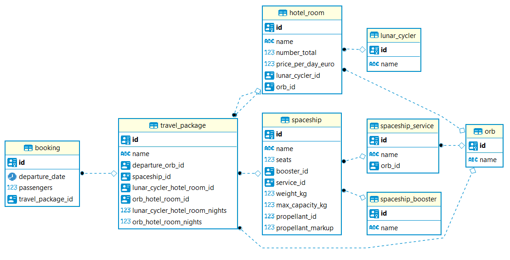

# Solution

## Assumptions

- A spaceship has a number of passenger seats. For a single booking, the flight cost is taking into account by dividing it by the number of seats.
- Each travel package is served by a specific spaceship.
- Each travel package includes specific hotel rooms.

## ER diagram

## Useful resources

- Spring Boot Actuator: http://localhost:8080/api/mgmt
- Swagger UI (API documentation): http://localhost:8080/swagger-ui.html

